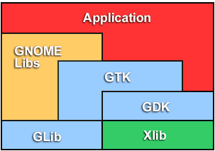

# learn-PyGTK

## 简介

* Python Gtk包仓库 : <https://pypi.org/project/PyGTK/>
* API : <https://lazka.github.io/pgi-docs/Gtk-3.0/index.html>
* 教程 : <https://python-gtk-3-tutorial.readthedocs.io/en/latest/>

## 架构图

---
