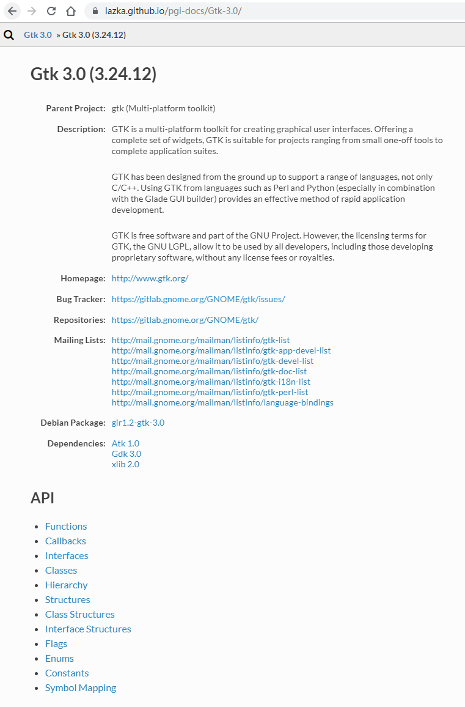

# API

* API : <https://lazka.github.io/pgi-docs/Gtk-3.0/index.html>

1. Functions
2. Callbacks
3. Interfaces
4. Classes
5. Hierarchy
6. Structures
7. Class Structures
8. Interface Structures
9. Flags
10. Enums
11. Constants
12. Symbol Mapping

---

