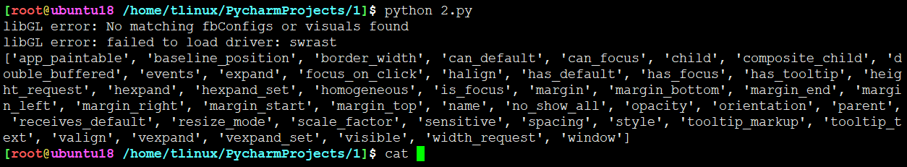

# 属性参数

1. 每个widget组件都提供了组多属性参数，配置参数便能够更改界面显示。那么意味着花式效果有着超级多的属性参数。例如一个按钮可能有个label标签，标明这个按钮的作用，是确认还是取消等等，也可以旋转角度。下面代码就是个例子：

```
label = Gtk.Label(label="This is Label", angle=25,halign=Gtk.Align.END)

其代码等同于

label = Gtk.Label()
label.set_label("This is Label")
label.set_angle(25)
label.set_halign(Gtk.Align.END)
```

除了getter和setter来获取和设置属性外，还可以通过props、set_property方法来处理


```
widget.props.prop_name = value   == widget.get_property("prop-name")
widget.get_property("prop-name") == widget.set_property("prop-name", value)
```

上方例子就可以写成这样：

```
label = Gtk.Label()
label.set_property("label","This is Label")
label.set_property("angle",25)
label.set_property("halign",Gtk.Align.END)
```

2. 如何知道widget有哪些属性可以修改？

这个应该开发环境IDE工具可视化罗列，代码的话可以通过print打印出来，如下：

```
widget = Gtk.Box()
print(dir(widget.props))
```



很明显，widget.props 就是对应组件的属性列表
