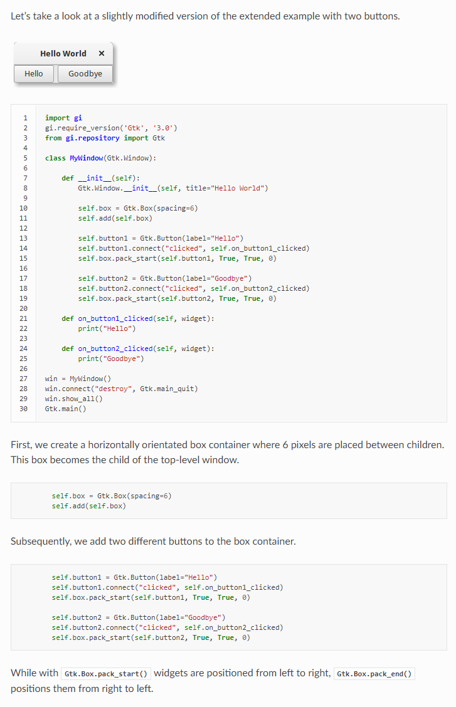
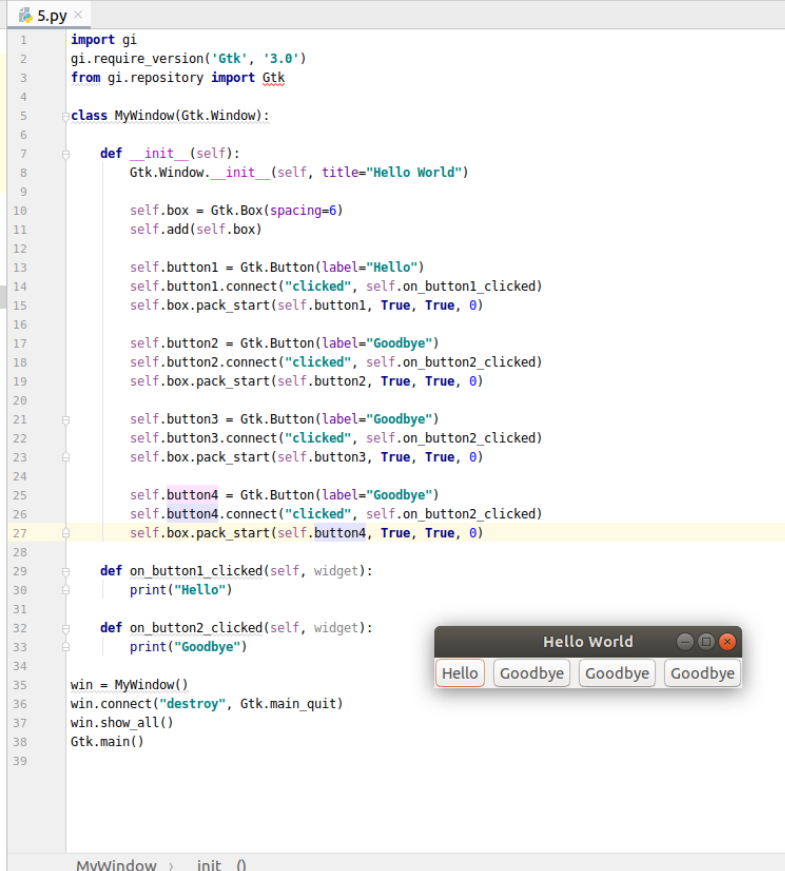

# Boxes

 

```
Boxes are invisible containers into which we can pack our widgets. When packing widgets into a horizontal box, the objects are inserted horizontally from left to right or right to left depending on whether Gtk.Box.pack_start() or Gtk.Box.pack_end() is used. In a vertical box, widgets are packed from top to bottom or vice versa. You may use any combination of boxes inside or beside other boxes to create the desired effect.
```

1. 把组件**水平**放入箱子中
2. 放置的顺序可以通过 [Gtk.Box.pack_start()](https://lazka.github.io/pgi-docs/Gtk-3.0/classes/Box.html#Gtk.Box.pack_start) 或 [Gtk.Box.pack_end()](https://lazka.github.io/pgi-docs/Gtk-3.0/classes/Box.html#Gtk.Box.pack_end)设定


## 代码及分析

```
import gi
gi.require_version('Gtk', '3.0')
from gi.repository import Gtk

class MyWindow(Gtk.Window):

    def __init__(self):
        Gtk.Window.__init__(self, title="Hello World")

        self.box = Gtk.Box(spacing=6)
        self.add(self.box)

        self.button1 = Gtk.Button(label="Hello")
        self.button1.connect("clicked", self.on_button1_clicked)
        self.box.pack_start(self.button1, True, True, 0)

        self.button2 = Gtk.Button(label="Goodbye")
        self.button2.connect("clicked", self.on_button2_clicked)
        self.box.pack_start(self.button2, True, True, 0)

        self.button3 = Gtk.Button(label="Goodbye")
        self.button3.connect("clicked", self.on_button2_clicked)
        self.box.pack_start(self.button3, True, True, 0)

        self.button4 = Gtk.Button(label="Goodbye")
        self.button4.connect("clicked", self.on_button2_clicked)
        self.box.pack_start(self.button4, True, True, 0)

    def on_button1_clicked(self, widget):
        print("Hello")

    def on_button2_clicked(self, widget):
        print("Goodbye")

win = MyWindow()
win.connect("destroy", Gtk.main_quit)
win.show_all()
Gtk.main()

```




## pack_start(child, expand, fill, padding)


## pack_end(child, expand, fill, padding)


---
