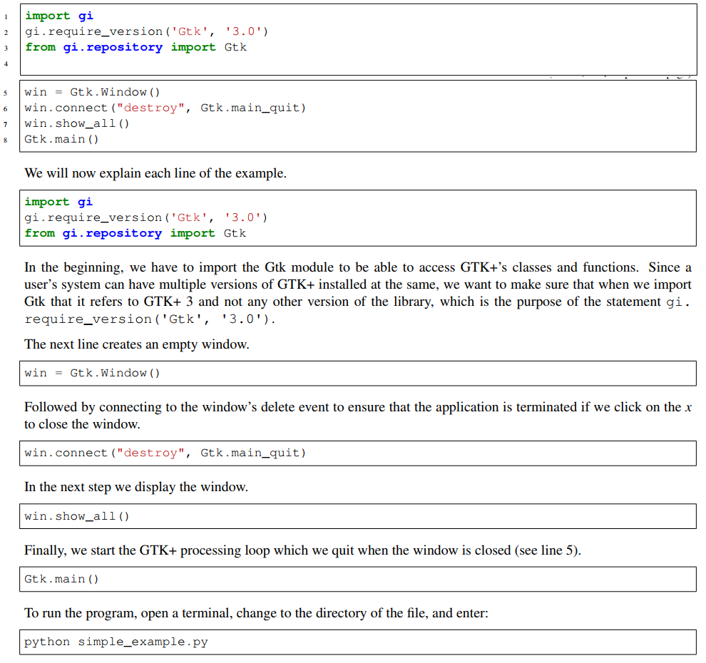
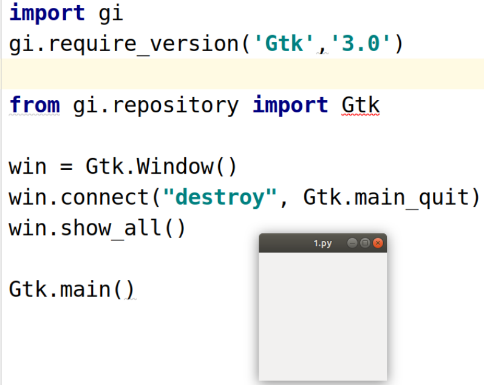
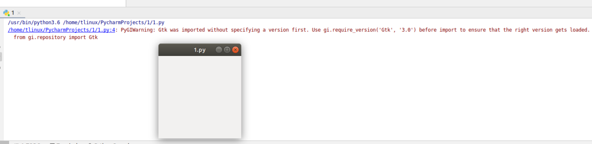
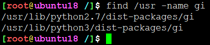
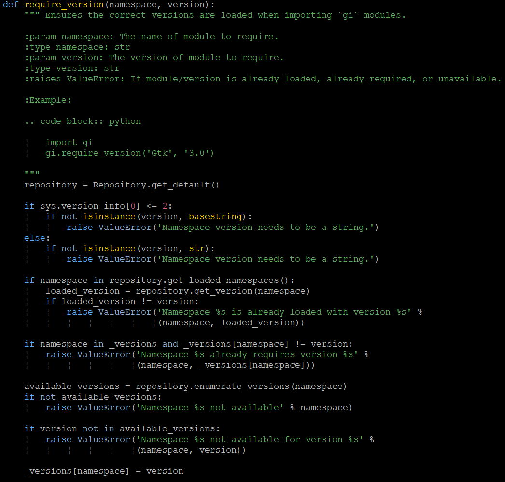
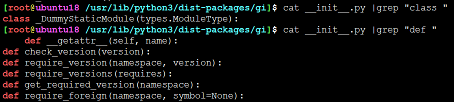
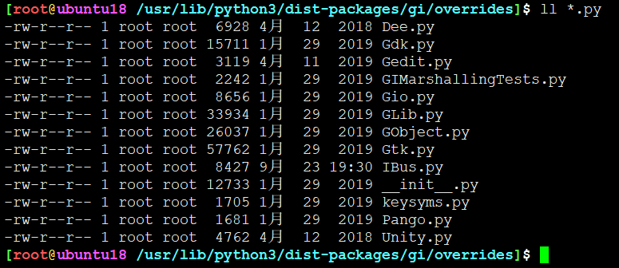
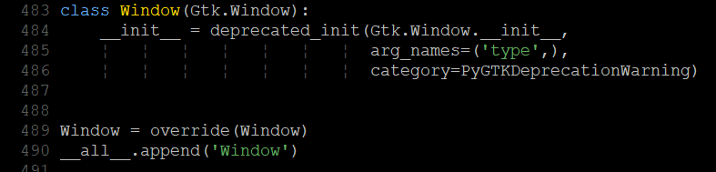
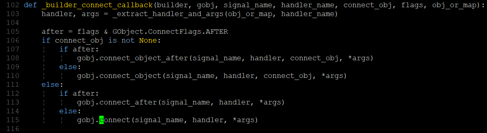

# Helloworld简单例子



## Helloworld PyGTK

```
import gi
gi.require_version('Gtk','3.0')

from gi.repository import Gtk

win = Gtk.Window()
win.connect("destroy", Gtk.main_quit)
win.show_all()

Gtk.main()
```

运行效果：



分析：

```
import gi
gi.require_version('Gtk','3.0')

from gi.repository import Gtk
```
说先导入 Gtk 模块，酱紫就能使用 Gtk+ 的诸多类和方法。但是因为系统中可能安装了多版本
的 GTK+ ,因此需要指定一个版本，来确保对应版本与当前环境的 GTK+ 版本一致

如何查看当前系统(Ubuntu 18.04.3 LTS) Gtk 版本

```
[root@ubuntu18 /]$ dpkg -l libgtk* | grep -e '^i' | grep -e 'libgtk-*[0-9]'
ii  libgtk-3-0:amd64             3.22.30-1ubuntu4 amd64        GTK+ graphical user interface library
ii  libgtk-3-bin                 3.22.30-1ubuntu4 amd64        programs for the GTK+ graphical user interface library
ii  libgtk-3-common              3.22.30-1ubuntu4 all          common files for the GTK+ graphical user interface library
ii  libgtk2.0-0:amd64            2.24.32-1ubuntu1 amd64        GTK+ graphical user interface library
ii  libgtk2.0-bin                2.24.32-1ubuntu1 amd64        programs for the GTK+ graphical user interface library
ii  libgtk2.0-common             2.24.32-1ubuntu1 all          common files for the GTK+ graphical user interface library
ii  libgtk3-perl                 0.032-1          all          Perl bindings for the GTK+ graphical user interface library
```

可以看到我的系统中 libgtk2.0 和 libgtk3.0 都存在。如果不指定版本，PyCharm会给出警告



导入包的时候都做了什么？最终一下gi包的位置



因为配置的Python版本默认为 python 3.6 因此，因该在 ```/usr/lib/python3/dist-packages/gi```
位置。

```
[root@ubuntu18 /usr/lib/python3/dist-packages/gi]$ find ./ -type f -name "*.py" |xargs wc -l
    30 ./repository/__init__.py
   152 ./importer.py
   205 ./docstring.py
    47 ./_constants.py
    54 ./_error.py
   372 ./_option.py
   349 ./types.py
   183 ./__init__.py
    53 ./overrides/keysyms.py
   450 ./overrides/Gdk.py
   236 ./overrides/IBus.py
   260 ./overrides/Gio.py
   726 ./overrides/GObject.py
    99 ./overrides/Gedit.py
  1601 ./overrides/Gtk.py
    55 ./overrides/Pango.py
   967 ./overrides/GLib.py
   350 ./overrides/__init__.py
    72 ./overrides/GIMarshallingTests.py
   144 ./overrides/Unity.py
   195 ./overrides/Dee.py
   275 ./module.py
   427 ./_propertyhelper.py
   262 ./_signalhelper.py
    27 ./pygtkcompat.py
  7591 total
```

真正包含的py包只有极少个，总共7591行代码。还是很少的，基本可以判断功能也没多少。

其中```gi.require_version```函数定义就在```/usr/lib/python3/dist-packages/gi/__init__.py```文件中






该包初始化文件包含一个类及其类函数和四个单独函数。内容也不多

继续，从gi.repository导入Gtk，位于 ```/usr/lib/python3/dist-packages/gi/repository/__init__.py```文件内容如下：

```
from __future__ import absolute_import
import sys
from ..importer import DynamicImporter
sys.meta_path.append(DynamicImporter('gi.repository'))
del DynamicImporter
del sys
```
从上层的importer类中加载模块。目测是为了快速切换版本弄得动态导入。


```
win = Gtk.Window()
win.connect("destroy", Gtk.main_quit)
win.show_all()

Gtk.main()
```

最终导入了 ```/usr/lib/python3/dist-packages/gi/override```下的py模块



其中Gtk.Window类在```/usr/lib/python3/dist-packages/gi/overrides/Gtk.py```文件中



**win.connect**，多态之后处理




---
