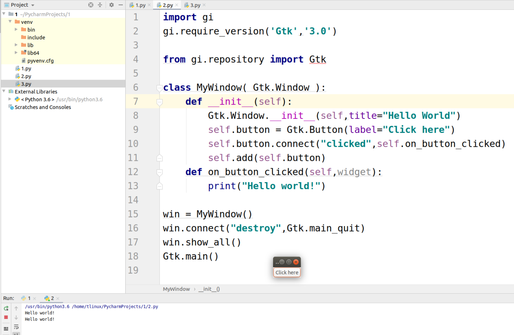
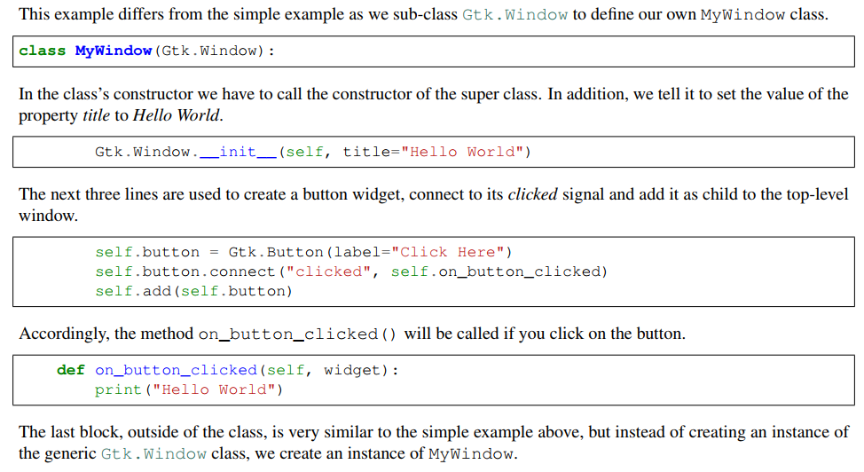

# 简单例子扩展



## 代码及分析

```
import gi
gi.require_version('Gtk','3.0')

from gi.repository import Gtk

class MyWindow( Gtk.Window ):
    def __init__(self):
        Gtk.Window.__init__(self,title="Hello World")
        self.button = Gtk.Button(label="Click here")
        self.button.connect("clicked",self.on_button_clicked)
        self.add(self.button)
    def on_button_clicked(self,widget):
        print("Hello world!")

win = MyWindow()
win.connect("destroy",Gtk.main_quit)
win.show_all()
Gtk.main()

```

 
