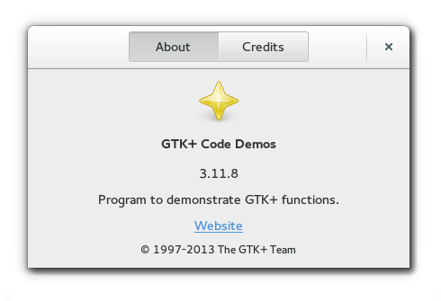
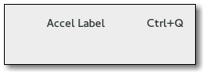
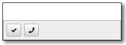
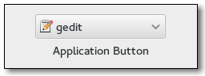
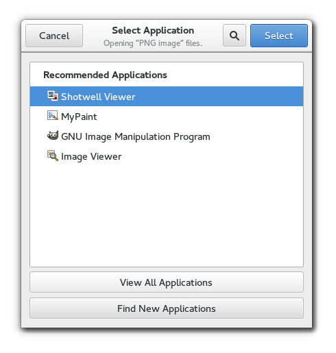
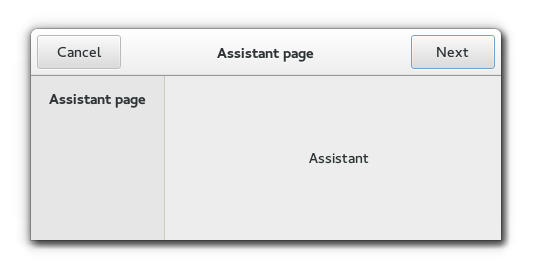
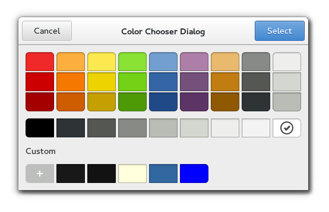
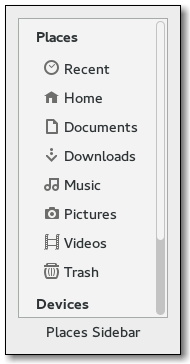

# 组件展示

组件蛮多，可以到网站<https://lazka.github.io/pgi-docs/Gtk-3.0/classes.html>查看


| 类型                   | 效果                                                |
| ---------------------- | --------------------------------------------------- |
| Gtk.AboutDialog        |  |
| Gtk.AccelLabel         |  |
| Gtk.ActionBar          |  |
| Gtk.AppChooserButton   |  |
| Gtk.AppChooserDialog   |  |
| Gtk.Assistant          |  |
| Gtk.Button             |  |
| Gtk.CheckButton        |  |
| Gtk.ColorButton        |  |
| Gtk.ColorChooserDialog |  |
| Gtk.PlacesSidebar      |  |
| Gtk.Spinner            |  |
|                        |                                                     |


```
Gtk.AboutDialog
Gtk.AccelGroup
Gtk.AccelLabel
Gtk.AccelMap
Gtk.Accessible
Gtk.Action
Gtk.ActionBar
Gtk.ActionGroup
Gtk.Adjustment
Gtk.Alignment
Gtk.AppChooserButton
Gtk.AppChooserDialog
Gtk.AppChooserWidget
Gtk.Application
Gtk.ApplicationWindow
Gtk.Arrow
Gtk.ArrowAccessible
Gtk.AspectFrame
Gtk.Assistant
Gtk.Bin
Gtk.BooleanCellAccessible
Gtk.Box
Gtk.Builder
Gtk.Button
Gtk.ButtonAccessible
Gtk.ButtonBox
Gtk.Calendar
Gtk.CellAccessible
Gtk.CellArea
Gtk.CellAreaBox
Gtk.CellAreaContext
Gtk.CellRenderer
Gtk.CellRendererAccel
Gtk.CellRendererCombo
Gtk.CellRendererPixbuf
Gtk.CellRendererProgress
Gtk.CellRendererSpin
Gtk.CellRendererSpinner
Gtk.CellRendererText
Gtk.CellRendererToggle
Gtk.CellView
Gtk.CheckButton
Gtk.CheckMenuItem
Gtk.CheckMenuItemAccessible
Gtk.Clipboard
Gtk.ColorButton
Gtk.ColorChooserDialog
Gtk.ColorChooserWidget
Gtk.ColorSelection
Gtk.ColorSelectionDialog
Gtk.ComboBox
Gtk.ComboBoxAccessible
Gtk.ComboBoxText
Gtk.Container
Gtk.ContainerAccessible
Gtk.ContainerCellAccessible
Gtk.CssProvider
Gtk.Dialog
Gtk.DrawingArea
Gtk.Entry
Gtk.EntryAccessible
Gtk.EntryBuffer
Gtk.EntryCompletion
Gtk.EntryIconAccessible
Gtk.EventBox
Gtk.EventController
Gtk.EventControllerKey
Gtk.EventControllerMotion
Gtk.EventControllerScroll
Gtk.Expander
Gtk.ExpanderAccessible
Gtk.FileChooserButton
Gtk.FileChooserDialog
Gtk.FileChooserNative
Gtk.FileChooserWidget
Gtk.FileFilter
Gtk.Fixed
Gtk.FlowBox
Gtk.FlowBoxAccessible
Gtk.FlowBoxChild
Gtk.FlowBoxChildAccessible
Gtk.FontButton
Gtk.FontChooserDialog
Gtk.FontChooserWidget
Gtk.FontSelection
Gtk.FontSelectionDialog
Gtk.Frame
Gtk.FrameAccessible
Gtk.GLArea
Gtk.Gesture
Gtk.GestureDrag
Gtk.GestureLongPress
Gtk.GestureMultiPress
Gtk.GesturePan
Gtk.GestureRotate
Gtk.GestureSingle
Gtk.GestureStylus
Gtk.GestureSwipe
Gtk.GestureZoom
Gtk.Grid
Gtk.HBox
Gtk.HButtonBox
Gtk.HPaned
Gtk.HSV
Gtk.HScale
Gtk.HScrollbar
Gtk.HSeparator
Gtk.HandleBox
Gtk.HeaderBar
Gtk.HeaderBarAccessible
Gtk.IMContext
Gtk.IMContextSimple
Gtk.IMMulticontext
Gtk.IconFactory
Gtk.IconInfo
Gtk.IconTheme
Gtk.IconView
Gtk.IconViewAccessible
Gtk.Image
Gtk.ImageAccessible
Gtk.ImageCellAccessible
Gtk.ImageMenuItem
Gtk.InfoBar
Gtk.Invisible
Gtk.Label
Gtk.LabelAccessible
Gtk.Layout
Gtk.LevelBar
Gtk.LevelBarAccessible
Gtk.LinkButton
Gtk.LinkButtonAccessible
Gtk.ListBox
Gtk.ListBoxAccessible
Gtk.ListBoxRow
Gtk.ListBoxRowAccessible
Gtk.ListStore
Gtk.LockButton
Gtk.LockButtonAccessible
Gtk.Menu
Gtk.MenuAccessible
Gtk.MenuBar
Gtk.MenuButton
Gtk.MenuButtonAccessible
Gtk.MenuItem
Gtk.MenuItemAccessible
Gtk.MenuShell
Gtk.MenuShellAccessible
Gtk.MenuToolButton
Gtk.MessageDialog
Gtk.Misc
Gtk.ModelButton
Gtk.MountOperation
Gtk.NativeDialog
Gtk.Notebook
Gtk.NotebookAccessible
Gtk.NotebookPageAccessible
Gtk.NumerableIcon
Gtk.OffscreenWindow
Gtk.Overlay
Gtk.PadController
Gtk.PageSetup
Gtk.Paned
Gtk.PanedAccessible
Gtk.PlacesSidebar
Gtk.Plug
Gtk.Popover
Gtk.PopoverAccessible
Gtk.PopoverMenu
Gtk.PrintContext
Gtk.PrintOperation
Gtk.PrintSettings
Gtk.ProgressBar
Gtk.ProgressBarAccessible
Gtk.PyGTKDeprecationWarning
Gtk.RadioAction
Gtk.RadioButton
Gtk.RadioButtonAccessible
Gtk.RadioMenuItem
Gtk.RadioMenuItemAccessible
Gtk.RadioToolButton
Gtk.Range
Gtk.RangeAccessible
Gtk.RcStyle
Gtk.RecentAction
Gtk.RecentChooserDialog
Gtk.RecentChooserMenu
Gtk.RecentChooserWidget
Gtk.RecentFilter
Gtk.RecentManager
Gtk.RendererCellAccessible
Gtk.Revealer
Gtk.Scale
Gtk.ScaleAccessible
Gtk.ScaleButton
Gtk.ScaleButtonAccessible
Gtk.Scrollbar
Gtk.ScrolledWindow
Gtk.ScrolledWindowAccessible
Gtk.SearchBar
Gtk.SearchEntry
Gtk.Separator
Gtk.SeparatorMenuItem
Gtk.SeparatorToolItem
Gtk.Settings
Gtk.ShortcutLabel
Gtk.ShortcutsGroup
Gtk.ShortcutsSection
Gtk.ShortcutsShortcut
Gtk.ShortcutsWindow
Gtk.SizeGroup
Gtk.Socket
Gtk.SpinButton
Gtk.SpinButtonAccessible
Gtk.Spinner
Gtk.SpinnerAccessible
Gtk.Stack
Gtk.StackAccessible
Gtk.StackSidebar
Gtk.StackSwitcher
Gtk.StatusIcon
Gtk.Statusbar
Gtk.StatusbarAccessible
Gtk.Style
Gtk.StyleContext
Gtk.StyleProperties
Gtk.Switch
Gtk.SwitchAccessible
Gtk.Table
Gtk.TearoffMenuItem
Gtk.TextBuffer
Gtk.TextCellAccessible
Gtk.TextChildAnchor
Gtk.TextMark
Gtk.TextTag
Gtk.TextTagTable
Gtk.TextView
Gtk.TextViewAccessible
Gtk.ThemingEngine
Gtk.ToggleAction
Gtk.ToggleButton
Gtk.ToggleButtonAccessible
Gtk.ToggleToolButton
Gtk.ToolButton
Gtk.ToolItem
Gtk.ToolItemGroup
Gtk.ToolPalette
Gtk.Toolbar
Gtk.Tooltip
Gtk.ToplevelAccessible
Gtk.TreeModelFilter
Gtk.TreeModelRow
Gtk.TreeModelRowIter
Gtk.TreeModelSort
Gtk.TreeSelection
Gtk.TreeStore
Gtk.TreeView
Gtk.TreeViewAccessible
Gtk.TreeViewColumn
Gtk.UIManager
Gtk.VBox
Gtk.VButtonBox
Gtk.VPaned
Gtk.VScale
Gtk.VScrollbar
Gtk.VSeparator
Gtk.Viewport
Gtk.VolumeButton
Gtk.Widget
Gtk.WidgetAccessible
Gtk.Window
Gtk.WindowAccessible
Gtk.WindowGroup

```
